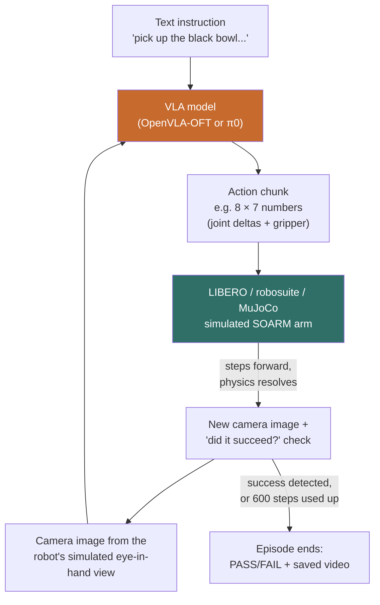
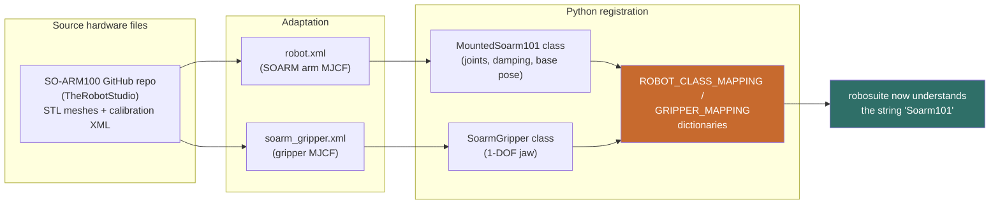
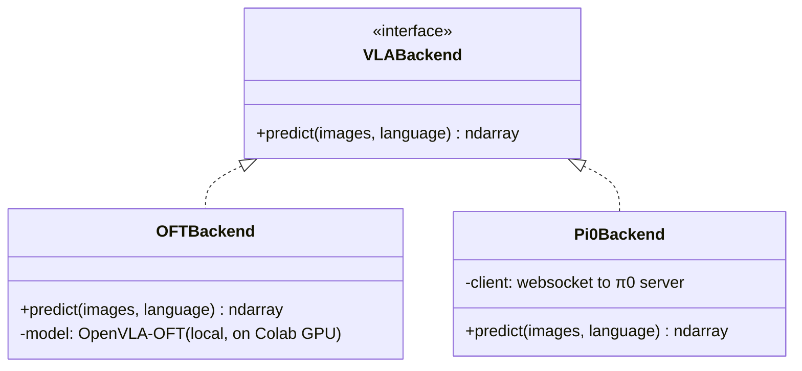

# How SOARM Learns to Move: Phases 1–3, Explained

> **TL;DR** — We built a pipeline where a robot arm (SOARM) living inside a physics simulator (LIBERO/MuJoCo) gets shown a camera image and a text instruction like *"pick up the black bowl"*, and a vision-language-action model (OpenVLA-OFT, or π0) outputs a sequence of joint movements to try it. We proved this works end-to-end with **two different AI models plugged into the exact same code**, on real Colab GPUs, with videos to prove it. The robot currently fails at the task (0% success) — and that's expected, not broken. Read on for why.

---

## 1. The three phases in one sentence each

| Phase | What it actually is |
|---|---|
| **Phase 1 — Colab Environment Setup** | Got a GPU notebook environment where LIBERO (the simulator) and OpenVLA-OFT (an AI model) both work together without version conflicts, using the *default* Panda robot arm — no SOARM yet. |
| **Phase 2 — SOARM Robot Integration** | Took SOARM's real hardware CAD/URDF files and taught the simulator's physics engine what a SOARM arm *is* — swapped it in for the default Panda arm. |
| **Phase 3 — VLA Inference Loop** | Wrote the actual "show the AI a picture, get a movement back, repeat" loop, and proved it works identically whether the AI is OpenVLA-OFT or π0. |

If none of "LIBERO," "MJCF," or "VLA" mean anything to you yet, the glossary in §2 will make everything after it click.

---

## 2. Glossary (read this first if you're lost)

| Term | What it means here |
|---|---|
| **LIBERO** | A benchmark/framework for testing robot-learning AI. It defines *tasks* (e.g. "pick up the bowl"), provides a *simulated environment* to attempt them in, and a *scoring protocol* to say whether the robot succeeded. |
| **robosuite** | The physics simulation library LIBERO is built on top of. It's the thing that actually simulates gravity, contact forces, and renders camera images. LIBERO adds tasks on top of robosuite's simulation. |
| **MuJoCo** | The physics engine underneath robosuite. Fast, accurate rigid-body physics — this is what makes a dropped object actually fall. |
| **MJCF** | MuJoCo's XML file format for describing a physical thing (a robot arm, a table, a gripper) — its joints, meshes, mass, motors. SOARM's MJCF file is essentially its "3D physics blueprint." |
| **BDDL** | *Behavior Domain Definition Language* — the file format LIBERO uses to define a task: what objects are on the table, where they start, and what state counts as "success" (e.g. "the bowl is on the plate"). |
| **VLA (Vision-Language-Action model)** | An AI model that takes a **camera image** + a **text instruction** and outputs a **robot action** (how much to move each joint). This project uses two: **OpenVLA-OFT** and **π0 (pi-zero)**. |
| **Action chunk** | Instead of predicting one tiny movement at a time, these models predict a short *sequence* of future movements in one go (OFT: 8 steps at once). The robot executes all 8 before asking the AI again. |
| **Checkpoint** | A specific trained/frozen version of an AI model's weights, downloaded from Hugging Face or Google Cloud Storage — e.g. `moojink/openvla-7b-oft-finetuned-libero-spatial` or π0's `pi05_libero`. |
| **Colab** | Google Colaboratory — free/rented cloud GPU notebooks. This project has **no local GPU**, so every real (non-mocked) test happens on Colab. |
| **Zero-shot cross-embodiment** | Using an AI model on a robot body it was **never trained on**. Both checkpoints here were trained on a Panda-arm robot, not SOARM — so we're testing whether the "skills" transfer to a different arm shape/gripper it's never seen. (Spoiler: not yet — see §6.) |

---

## 3. The big picture

Here's the entire system, top to bottom:



This loop — **look → decide → move → check → repeat** — runs inside a single Python function (`run_episode`, built in Phase 3). Everything in Phases 1 and 2 exists purely to make the two colored boxes above (the VLA, and the simulated SOARM) actually work.

---

## 4. Phase 1 — Colab Environment Setup

**The problem this solved:** LIBERO and OpenVLA-OFT each depend on specific, easy-to-conflict versions of PyTorch, `transformers`, `numpy`, and MuJoCo. Getting all of them installed *together* on a fresh Colab machine, in the right order, without one package silently breaking another, was itself the hard part.

**What was actually built:** `LIBERO/notebooks/01-colab-env-setup.ipynb` — a 25-cell notebook, split into two blocks:

- **Block A (install):** installs EGL rendering libraries, PyTorch 2.2.0, MuJoCo/robosuite/LIBERO, then OpenVLA-OFT's dependencies — ending with a "numpy ABI gate" cell that forces a clean, single, correctly-linked numpy install (this exact class of bug — a "half-upgraded" numpy — caused multiple crashes described later in Phase 3 too).
- *(mandatory Colab runtime restart here — a fresh Python process is needed for the freshly-pinned packages to load cleanly)*
- **Block B (verify):** three checks, each printing `PASS`/`FAIL`:
  - **ENV-01** — are all the installed package versions what we expect?
  - **ENV-02** — does the simulator render a real (non-black) camera frame from the *default Panda* robot?
  - **ENV-03** — does OpenVLA-OFT load on the GPU and produce a `(7,)`-shaped action from a dummy image?

**What you'd see running it:** version tables, a rendered robot-arm image inline in the notebook, and a final `ENV-03: PASS` printout once the model successfully returns a real action shape.

At the end of Phase 1: **no SOARM yet** — this proved the *stack* (simulator + AI model together) works at all, using LIBERO's default Panda arm.

---

## 5. Phase 2 — SOARM Robot Integration

**The problem this solved:** LIBERO/robosuite ships with several robot arms built in (Panda, Sawyer, UR5e...) — but not SOARM. Simulators don't know what a robot "is" until you describe its physical shape, joints, and motors in their language (MJCF).

**What was actually built:**



Concretely:
- SOARM's real hardware description (13 STL meshes + calibration XML) was vendored in from the upstream `TheRobotStudio/SO-ARM100` repo.
- `MountedSoarm101` — a Python class describing SOARM to robosuite: 5 arm joints, their damping, where the arm sits relative to the table.
- `SoarmGripper` — a 1-degree-of-freedom jaw gripper (open/close), separate from the arm.
- Both got registered into robosuite's internal name-lookup dictionaries — the same mechanism that already knows the string `"Panda"` means the default arm. After this, `robots=["Soarm101"]` in code just... works, exactly like `robots=["Panda"]` did.
- **Physics was tuned and measured**, not assumed: reset contact force measured at 0.024 N (safety threshold was 10 N — huge margin), and a generic position controller (OSC_POSE) was confirmed sufficient with no custom tuning.
- **3 tasks were selected** from LIBERO's existing `libero_spatial` task suite (nothing new authored) — chosen specifically because they're within SOARM's shorter physical reach (0.479 m) compared to Panda's, having measured and rejected one task (0.498 m reach) as physically out of range.

**What you'd see running it:** a second Colab notebook (`02-soarm-integration-check.ipynb`) rendering the actual SOARM arm in the scene (agentview + eye-in-hand camera views), plus PASS/FAIL checks confirming the arm compiles, registers, holds still under gravity, and runs 50 random steps across all 3 selected tasks without crashing.

At the end of Phase 2: **the simulator now contains a real, physically-plausible SOARM arm** you can send commands to — but nothing intelligent is sending those commands yet.

---

## 6. Phase 3 — The actual inference loop (this is the part you asked about)

This is where "the AI controls the robot" actually happens. Two things were built:

### 6.1 The shared interface — one function signature, two AI models

Every VLA model in this project implements exactly **one method**:

```python
predict(images: dict, language: str) -> np.ndarray
```

Give it a camera image and an instruction string, get back an array of numbers (the action). That's the entire contract. Because both OpenVLA-OFT and π0 implement *only* this, the surrounding code (`run_episode`, `run_suite`) never needs to know or care which AI is actually running — this is the literal thing Phase 3 set out to prove (**VLA-04**, the phase's headline success criterion).



### 6.2 What `predict()` actually does, per model

**OpenVLA-OFT (`OFTBackend`) — runs the AI model directly, in-process:**
1. Wraps the camera frame as a `PIL.Image`, builds a prompt: `"In: What action should the robot take to {language}?\nOut:"`
2. Feeds image + prompt through the model on the GPU (`model.predict_action(...)`)
3. Un-normalizes the output using stats specific to the LIBERO-spatial fine-tune
4. Returns an **8×7 array** — 8 future timesteps, 7 numbers each (6 arm-pose deltas + 1 gripper command)

**π0 (`Pi0Backend`) — talks to a *separate process* over a network socket:**

π0's own software stack (a different, incompatible version of PyTorch/JAX) can't coexist in the same Python process as OpenVLA-OFT's. So instead of loading the model directly, `Pi0Backend` is a thin **websocket client**:

```mermaid
sequenceDiagram
    participant Loop as run_episode() loop
    participant PB as Pi0Backend.predict()
    participant WS as websocket
    participant Srv as serve_policy.py<br/>(separate process, own GPU model)

    Loop->>PB: predict(image, "pick up the bowl")
    PB->>PB: resize image to 224x224,<br/>build observation dict
    PB->>WS: send observation
    WS->>Srv: forward over localhost:8000
    Srv->>Srv: run π0 model on GPU
    Srv-->>WS: action chunk
    WS-->>PB: receive
    PB-->>Loop: return np.ndarray
```

This is *why* Notebook B needs **two separate Colab kernels** — one running `serve_policy.py` (the actual π0 model, in its own isolated environment), and the LIBERO/robosuite side connecting to it as a client. Same simulator, same task, same loop code — just a network hop instead of a direct function call to reach the AI.

### 6.3 The loop itself, one episode

This is `run_episode()` — the actual "run the robot" function, and it's genuinely short:

```mermaid
sequenceDiagram
    participant Env as LIBERO Environment<br/>(SOARM in simulation)
    participant Loop as run_episode()
    participant VLA as VLA backend<br/>(OFT or π0)

    Loop->>Env: reset()
    Env-->>Loop: initial camera image
    loop until success or 600 steps
        Loop->>VLA: predict(image, instruction)
        VLA-->>Loop: action chunk (e.g. 8 actions)
        loop for each action in chunk
            Loop->>Env: step(action)
            Env-->>Loop: new image, success?
            alt success detected mid-chunk
                Loop->>Loop: stop immediately
            end
        end
    end
    Loop->>Loop: save video, print PASS/FAIL
```

Key details worth knowing:
- The AI is **not** asked for a new action every single physics step — it predicts a *chunk* of several actions at once and the loop plays them all out ("open-loop replay"), only asking again once the chunk is exhausted (or success happens mid-chunk, which stops everything immediately).
- Every episode gets a **saved video file** — every step, frame by frame.
- After 600 steps with no success, the episode is a hard FAIL — no partial credit.
- `run_suite()` just calls `run_episode()` in a loop across tasks × episode counts, then prints an aggregated markdown table (episodes / successes / success rate) — this is exactly the table you saw print at the end of your Colab run.

### 6.4 Two notebooks, mirroring the two backends

| | Notebook A (`03a-oft-inference-eval.ipynb`) | Notebook B (`03b-pi0-inference-smoketest.ipynb`) |
|---|---|---|
| Runs on | Colab A100 | Colab A100 or L4 |
| Backend | `OFTBackend` (local model) | `Pi0Backend` (websocket client) |
| Also installs | Nothing extra (Phase 1's environment already has everything) | openpi + its own separate dependency stack, **plus** LIBERO's simulation stack (robosuite/mujoco/bddl — added later, see §8) |
| Scale | 3 tasks × 8 episodes each (bigger eval) | 1 task × 2 episodes (interface-swap smoke test, deliberately lighter) |
| Proves | VLA-01, VLA-02, VLA-03 | VLA-04 |

---

## 7. "0% success rate" — is that a bug?

**No — it's the expected result, and here's exactly why.**

Both checkpoints (`moojink/openvla-7b-oft-finetuned-libero-spatial` and π0's `pi05_libero`) were **fine-tuned on a Panda-arm robot's demonstrations**. SOARM has a different gripper, different reach, different joint kinematics. Asking a model that's only ever seen "Panda picking up a bowl" to control "SOARM picking up a bowl" — with zero SOARM-specific training — is a **zero-shot cross-embodiment transfer** test. That's a genuinely hard, mostly-unsolved problem in robot learning; failing it isn't a pipeline defect, it's the honest baseline.

What the videos actually show (human-verified, both models): the arm **correctly approaches** the target object and **opens the gripper at roughly the right moment** — meaning the "high-level plan" (where's the bowl, move toward it, prepare to grab) transferred. What doesn't happen is completing the precise close-grasp-lift-place sequence — the low-level motor control didn't transfer.

**Closing this gap is explicitly Phase 6's job** (fine-tuning OFT/π0 on real SOARM demonstration data, which Phase 4 will collect). Phase 3's job was narrower and *is* done: prove the loop runs, prove the interface is swappable, prove it's measuring correctly. It was never "make the robot succeed."

---

## 8. What actually went wrong along the way (worth knowing before you run it)

The π0 path in particular took **seven separate live-debugging rounds** to get working — none of these were design flaws, they were real-world Colab/dependency gremlins, each fixed as it was hit:

1. π0's originally-planned checkpoint name (`pi0_fast_libero`) was deprecated upstream between planning and first run → switched to the currently-supported `pi05_libero`.
2. The 11.6 GB checkpoint download kept failing partway through.
3. ...because `gsutil` (Google's download tool) runs its own **completely separate, isolated Python** from the notebook's — so a `pip install` in the notebook never reached it. Fixed with an env var (`CLOUDSDK_PYTHON_SITEPACKAGES=1`) that tells it to look in the notebook's packages too.
4. A defensive "if this import fails, just skip it" guard in the shared code was written to catch the wrong *kind* of error (`ImportError`) when the real failure was a different kind (`ValueError`, from mismatched numpy versions) — so it crashed instead of skipping gracefully. Widened the guard.
5. Notebook B had never actually installed LIBERO's simulator itself (robosuite/mujoco) — only π0's own AI stack. A whole extra install step was missing from the original plan.
6. The π0 server process would silently freeze mid-run because its log output was piped somewhere nobody was reading, and the pipe filled up and blocked it. Fixed by writing logs to a file instead.
7. The websocket connection to the π0 server would occasionally drop mid-episode (most likely: the AI model recompiling itself for a new input shape took longer than the connection's 20-second keep-alive timeout). Fixed by having the client automatically reconnect and retry instead of crashing.

None of this changes *what* the system does — it's the difference between "designed to work" and "actually, provably works on a real GPU," which is exactly what Phase 3's human-verify checkpoints exist to force.

---

## 9. How to run this yourself

You need a **Google Colab GPU runtime** — there is no local GPU in this project, so nothing VLA-related can be verified on your Mac directly.

### To run OpenVLA-OFT (the more mature, single-notebook path):

1. Make sure `SoARM-Research-colab.zip` on your Google Drive is up to date (I regenerate and swap this file whenever the code changes — see below if you need it refreshed).
2. Open `LIBERO/notebooks/03a-oft-inference-eval.ipynb` in Colab.
3. Runtime → Change runtime type → **A100 GPU**.
4. Run Block A cells top to bottom (installs), then **restart the runtime** when told to.
5. Run Block B cells top to bottom — this mounts Drive, unzips the repo fresh, sets up LIBERO, loads OpenVLA-OFT, and runs the full 3-task × 8-episode eval.
6. Watch for the final markdown table and check `LIBERO/notebooks/outputs/videos_oft/` for saved episode videos.

### To run π0 (two-kernel setup — more involved):

1. Same Drive-zip freshness check.
2. Open `LIBERO/notebooks/03b-pi0-inference-smoketest.ipynb` in its **own separate Colab runtime** (never the same kernel as Notebook A — the two AI models' dependencies conflict).
3. Runtime → **A100 or L4 GPU**.
4. Run cells top to bottom: **Block A2** (installs LIBERO's simulator stack) → **mandatory restart** → re-run the first few setup cells → **Block A** (installs openpi itself) → the package-legitimacy checkpoint (a one-time manual PyPI check) → start the π0 server → run the smoke test cell.
5. Watch for `Episode 0/1 ... -> .../videos_pi0/...` lines and the final summary table.
6. If anything hangs or errors, check `!tail -n 60 /content/serve_policy.log` first — that's the π0 server's own logs, and usually tells you immediately what's wrong.

### Where the "regenerate the Drive zip" step comes from

Because `LIBERO/` is git-ignored in this repo (it's a vendored fork with its own history) and Colab can't `git clone` a private local checkout, code changes reach Colab via a zip file on your Google Drive, not git. Whenever the code changes, I re-zip `LIBERO/` and swap it into `SoARM-Research-colab.zip` on your Drive — Colab's first cell in every notebook always re-unzips fresh on each run, so as long as that zip is current, you're running the latest code.

---

## 10. What's real, what's still a placeholder

| Claim | Status |
|---|---|
| SOARM exists as a real, physically-simulated robot in LIBERO | ✅ Real — measured contact forces, confirmed camera render, runs 50-step random-action soak tests without crashing |
| OpenVLA-OFT loads and produces real actions on a real GPU | ✅ Real — confirmed on Colab A100, `(8,7)` action chunk verified |
| π0 loads and produces real actions on a real GPU | ✅ Real — confirmed on Colab L4, full 2-episode run completed |
| Both models drive the *exact same* control loop code, unmodified | ✅ Real — this is VLA-04, the phase's core claim, and it's literally true (same `run_suite`/`eval_loop.py`) |
| SOARM can actually complete the tasks it's asked | ❌ Not yet — 0% success, expected zero-shot baseline (§7), Phase 6's job |
| Real (physical) SOARM hardware in the loop | ❌ Not in scope for this project's current milestone — simulation-only, physical robot is a later milestone |
| Multi-camera / 3D spatial reasoning | ❌ Not built yet — Phase 5 |
| Fine-tuning on SOARM-specific data | ❌ Not built yet — needs Phase 4's dataset collection first, then Phase 6 |

---

## 11. Quick file map

```
LIBERO/
├── libero/libero/
│   ├── assets/robots/soarm101/        # SOARM's MJCF + meshes (Phase 2)
│   ├── assets/grippers/soarm_gripper.xml
│   ├── envs/robots/soarm.py           # MountedSoarm101 class (Phase 2)
│   ├── envs/grippers/soarm_gripper.py # SoarmGripper class (Phase 2)
│   └── vla/                           # Phase 3's shared package
│       ├── interface.py               #   the VLABackend contract
│       ├── eval_loop.py               #   run_episode / run_suite
│       ├── oft_backend.py             #   OpenVLA-OFT implementation
│       └── pi0_backend.py             #   π0 websocket client
└── notebooks/
    ├── 01-colab-env-setup.ipynb       # Phase 1
    ├── 02-soarm-integration-check.ipynb  # Phase 2
    ├── 03a-oft-inference-eval.ipynb   # Phase 3, OFT
    └── 03b-pi0-inference-smoketest.ipynb # Phase 3, π0
```

---

*This document summarizes work completed through Phase 3 (2026-08-02). See `.planning/phases/` in the repo for the full decision-by-decision history if you want more depth than this gives.*
